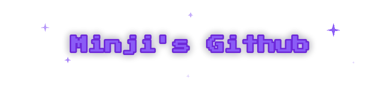

  

 

  

**🎓 Education**

**📜 Certificates**

 

  

<table align="center" width="720">
  <tr>
    <td width="160" align="center"><b>Languages</b></td>
    <td align="center">
      
      
      
      
    </td>
  </tr>
  <tr>
    <td width="160" align="center"><b>Frontend</b></td>
    <td align="center">
      
      
      
      
    </td>
  </tr>
  <tr>
    <td width="160" align="center"><b>Backend</b></td>
    <td align="center">
      
      
    </td>
  </tr>
  <tr>
    <td width="160" align="center"><b>Database</b></td>
    <td align="center">
      
      
      
      
    </td>
  </tr>
  <tr>
    <td width="160" align="center"><b>DevOps & Tools</b></td>
    <td align="center">
      
      
      
      
      
      
    </td>
  </tr>
</table>

 

  

<table align="center" width="720">
  <tr>
    <td width="160" align="center">
      <a href="https://github.com/gibunijjaejo/Opensource_Project"><b>서간표 (Seoganpyo)</b></a>  
      
    </td>
    <td>
      시간표 이미지 한 장으로 <b>졸업요건 충족 여부 · 맞춤 강의 · 강의계획서 요약</b>까지 받는 AI 학업 컨설팅 플랫폼 
      <b>담당</b> — DB 설계 · 시간표 OCR 업로드 · CRUD · AI 요약 · MCP · 모니터링(Grafana KPI)
    </td>
  </tr>
  <tr>
    <td width="160" align="center">
      <a href="https://github.com/capdiinmyear/radar-guard"><b>Radar-Guard</b></a>  
      
    </td>
    <td>
      mmWave 레이더와 시계열 딥러닝(PointNet·Bi-LSTM)으로 <b>낙상을 실시간 비접촉 감지</b>하는 환자 안전 모니터링 시스템. 영상 없이 라즈베리파이 온디바이스 추론 → 즉시 알림으로 프라이버시까지 보호 
      <b>담당</b> — 데이터 수집 모듈 · 자체 데이터셋 구축/라벨링 · 백엔드 API · 실시간 대시보드 UI
    </td>
  </tr>
</table>

 

  
    
  

