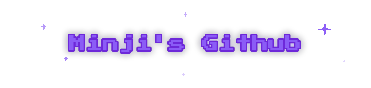

  

---

 

  

**🎓 Education**

**📜 Certificates**

 

  

<table align="center" width="720">
  <tr>
    <td width="160" align="center"><b>Languages</b></td>
    <td align="center">
      
      
      
      
    </td>
  </tr>
  <tr>
    <td width="160" align="center"><b>Frontend</b></td>
    <td align="center">
      
      
      
      
    </td>
  </tr>
  <tr>
    <td width="160" align="center"><b>Backend</b></td>
    <td align="center">
      
      
    </td>
  </tr>
  <tr>
    <td width="160" align="center"><b>Database</b></td>
    <td align="center">
      
      
      
      
    </td>
  </tr>
  <tr>
    <td width="160" align="center"><b>DevOps & Tools</b></td>
    <td align="center">
      
      
      
      
      
      
    </td>
  </tr>
</table>

 

  

<table align="center" width="720">
  <tr>
    <td width="160" align="center">
      <a href="https://github.com/alswl722/FastApi-Todos"><b>FastAPI Todos (개인)</b></a>  
      
    </td>
    <td>
      할 일·일기장 웹 서비스를 11주 동안 혼자 만들며 <b>테스트 → 정적 분석 → 모니터링 → 부하 테스트 → CI/CD</b>를 한 단계씩 쌓은 개인 프로젝트 (v1.0.0 → v7.1.0) 
      <b>담당</b> — 전체 · Playwright E2E · SonarQube · Prometheus/Grafana/Loki · JMeter + InfluxDB · Jenkins 8단계 파이프라인
    </td>
  </tr>
  <tr>
    <td width="160" align="center">
      <a href="https://github.com/kuchipachi/seoganpyo"><b>서간표 (Seoganpyo)</b></a>  
      
    </td>
    <td>
      시간표 이미지 한 장으로 <b>졸업요건 충족 여부 · 맞춤 강의 · 강의계획서 요약</b>까지 받는 AI 학업 컨설팅 플랫폼. 학교 VDI에서 <b>AWS로 옮겨 운영</b> 중 
      <b>담당</b> — DB 설계 · 로그 관측 스택(Loki·Grafana) · Jenkins 배포 단계 · k6 부하 테스트 파이프라인 · 과부하 교착 장애 분석 · 강의 목록 N+1 제거 📄 <a href="https://github.com/kuchipachi/seoganpyo/blob/dev/docs/performance.md">성능 측정 기록</a> · <a href="https://github.com/kuchipachi/seoganpyo/blob/dev/docs/postmortems/2026-09-27-db-pool-deadlock.md">DB 풀 교착 포스트모템</a> · <a href="https://github.com/kuchipachi/seoganpyo/pull/29">N+1 제거 PR</a> · <a href="https://github.com/gibunijjaejo/Opensource_Project">수업 제출판</a>
    </td>
  </tr>
  <tr>
    <td width="160" align="center">
      <a href="https://github.com/capdiinmyear/radar-guard"><b>Radar-Guard (스마트 병상)</b></a>  
      
    </td>
    <td>
      mmWave 레이더로 <b>낙상을 비접촉 감지</b>해 간호사에게 즉시 알리는 환자 안전 모니터링 시스템 · <b>캡스톤디자인 경진대회 동상</b> 
      <b>담당</b> — FastAPI 백엔드 초기 구축 · 간호사 PWA Web Push 알림 · 재실 판정 상태머신 · 실시간 대시보드
    </td>
  </tr>
  <tr>
    <td width="160" align="center">
      <b>감탄 (GamTan)</b>  
      비공개 저장소
    </td>
    <td>
      거래 증빙 문서에서 탄소배출량을 산정하는 AI Agent · <b>iM:POSSIBLE Challenger 본선 진출</b> 
      <b>담당</b> — 문서 추출 파이프라인(PDF → OCR → 표 매칭 → LLM 4단계 폴백) · Docker Compose + Supabase 개발 인프라 · 팀 PR 리뷰·머지
    </td>
  </tr>
  <tr>
    <td width="160" align="center">
      <a href="https://github.com/alswl722/NaRan"><b>나란 (NaRan)</b></a>  
      
    </td>
    <td>
      지속가능경영보고서의 환경 주장과 공개 데이터를 같은 기준으로 맞춘 뒤 대조하는 <b>녹색여신 사후관리 보조 도구</b> · KB Future Finance AI Challenge 
      <b>담당</b> — 비교 가능성 검사 엔진 · Gemini 구조화 추출 · 감사 이력 · API 키 없이 재현되는 실행 모드 (커밋 78%)
    </td>
  </tr>
  <tr>
    <td width="160" align="center">
      <a href="https://github.com/alswl722/dive-BTP-public"><b>dive-BTP</b></a>  
      
    </td>
    <td>
      기업신용데이터(KODATA)와 지원 이력을 결합해 <b>기업 심사 검토자료</b>를 만드는 도구 · DIVE 2026 부산 데이터 해커톤 본선 진출 
      <b>담당</b> — 재무 파생 지표 24개와 공통 방어 모듈 · 동종군 백분위 스코어링 · 결측 데이터 오류 발견·수정
    </td>
  </tr>
  <tr>
    <td width="160" align="center">
      <a href="https://github.com/TeamKimFour/RobuSTAM"><b>RobuSTAM</b></a>  
      
    </td>
    <td>
      강화학습 자산배분 전략을 거래비용까지 반영해 검증하는 <b>퀀트 백테스팅 MLOps 플랫폼</b> 
      <b>담당</b> — Feature Store · walk-forward 검증 · GitHub Actions 일일 워크플로 · S3(GitHub OIDC) · MLflow 기록
    </td>
  </tr>
</table>

 

  
    
  

